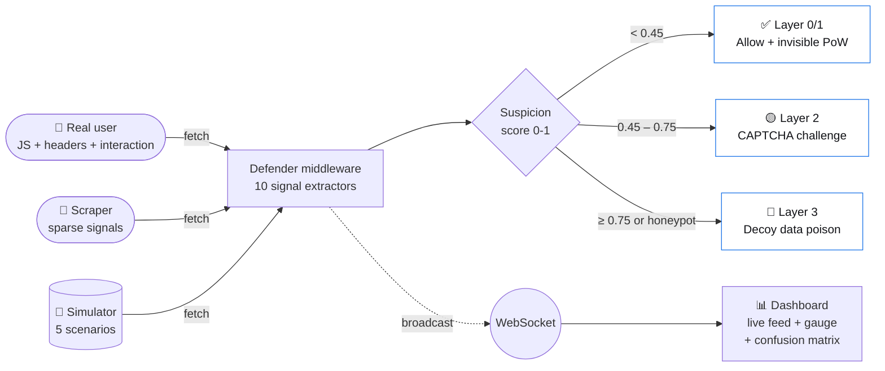
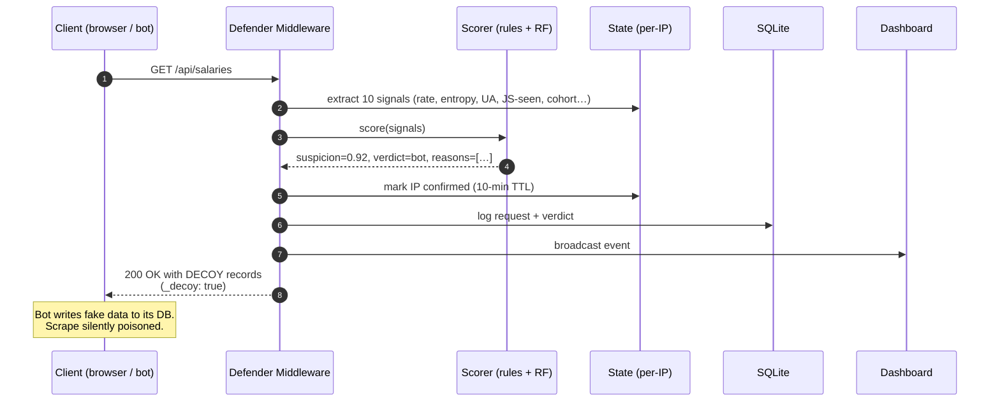
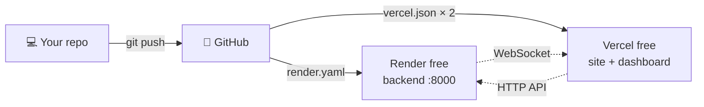

<p align="center">
  
</p>

<h1 align="center">
  <span style="color:#1E5BEC">this</span><span style="color:#F57C00">1</span>
</h1>

<p align="center"><i>Three-layer adaptive bot defense for Levels.fyi compensation data.</i></p>

<p align="center">
  
  
  
  
  
</p>

<p align="center">
  
  
  
  
  
</p>

<p align="center">
  <a href="#-quick-start"><b>Quick start</b></a> ·
  <a href="#%EF%B8%8F-architecture"><b>Architecture</b></a> ·
  <a href="#-detection-signals"><b>Signals</b></a> ·
  <a href="#-attack-scenarios"><b>Attacks</b></a> ·
  <a href="#-deploy"><b>Deploy</b></a> ·
  <a href="demo/runbook.md"><b>Live-demo runbook</b></a>
</p>

> **Hackathon submission · Levels.fyi · Problem Statement 2 — Bot Detection & Anti-Scraping.**
> Built end-to-end in 24hrs: FastAPI defender, trained scikit-learn classifier, React dashboard, 5-scenario attack simulator, custom-branded API explorer.

---

## 💡 The reason of this projecth

The judge confirmed in the briefing that Levels.fyi's current bot-vs-real-user blockage ratio is *"somewhere low, a little higher than that"* — meaning they suffer **both** uncaught scrapers **and** false-positive complaints. A single hard rate-limit can't fix both. **this1** tiers the response:

| Tier | When | Action | Real-user impact |
|------|------|--------|------------------|
| **L1 — Invisible PoW** | Every request | Browser solves a 50ms SHA-256 puzzle | None (humans never notice) |
| **L2 — CAPTCHA** | Suspicion ≥ 0.45 | In-house emoji challenge (no third-party) | Click an animal — 3 seconds |
| **L3 — Decoy data** | Suspicion ≥ 0.75 or honeypot hit | Serve plausible-but-fake records (`Initech`/`Hooli`/`$1`) | None — only bots see it |

The result: **near-zero friction for humans, near-zero useful data for bots.**

---

## ⚡ Quick start

```bash
# 1. Backend (FastAPI + ML)
cd backend
pip install -r requirements.txt
python -m app.seed              # ~250 mock salary records → SQLite
python -m ml.train              # 50k-row synth dataset → train RF + IsolationForest (~10s)
uvicorn app.main:app --reload   # http://localhost:8000

# 2. Protected site (mini Levels.fyi clone)
cd ../frontend/site
npm install && npm run dev      # http://localhost:3000

# 3. Defender dashboard
cd ../dashboard
npm install && npm run dev      # http://localhost:3001

# 4. Fire an attack (or use the in-dashboard "Launch Attack" panel)
cd ../../simulator
pip install -r requirements.txt
python attack.py --list
python attack.py --scenario naive-scraper --duration 20
```

### Three URLs to open

| URL | What you see | Who it's for |
|---|---|---|
| http://localhost:3000 | Mini Levels.fyi clone — search, browse companies, click salaries | The "prey" — what bots want to scrape |
| http://localhost:3001 | Live dashboard — gauge, kill-chain, top IPs, **Launch Attack** buttons | The cockpit (best demo surface) |
| http://localhost:8000 | Branded backend landing — links to API explorer, ReDoc, raw JSON endpoints | The engine room |

> 🎬 **For the live demo**, just open the dashboard at `:3001` and click any attack scenario. The kill chain fires in front of you — no terminal needed.

---

## 🏗️ Architecture



### How a single request flows



---

## 🎯 Detection signals

10 behavioral features feed both a rule scorer and a trained `RandomForestClassifier` (blended).

| # | Signal | Bot tell | Source |
|---|---|---|---|
| 1 | Request rate (sliding 10s / 60s) | high | per-IP deque |
| 2 | URL traversal entropy | low (sequential IDs) | path window |
| 3 | User-Agent quality (5 sub-features) | missing / known-bot / spoofed-crawler | UA parsing |
| 4 | Header completeness | sparse | request headers |
| 5 | JS execution evidence | absent | client beacon |
| 6 | Mouse/scroll/keyboard interaction | zero | client beacon |
| 7 | Navigation diversity (unique paths) | low | path history |
| 8 | Session shape (req/sec over lifetime) | imbalanced | first-seen timestamp |
| 9 | Honeypot URL hit | instant fail | hidden `<a>` in nav |
| 10 | TLS / header consistency + cohort | inconsistent | `sec-fetch-*` vs UA; cohort fingerprint |

### Model metrics (on 10k held-out synthetic samples)

```
Confusion matrix
              predicted-0  predicted-1
actual-0         5758          35     ← 0.60% false-positive
actual-1           59         4148    ← 98.6% recall (catches bots)

Accuracy 99.06%   ·   F1 0.99   ·   Top features: path_entropy · interaction_score · nav_diversity
```

Trained on a **50k-row synthetic dataset with intentional noise + persona crossovers** — that's why accuracy is 99%, not the suspicious 100% you'd get from clean personas. See [ml/generate_dataset.py](backend/ml/generate_dataset.py).

> 📌 **Per Deveesh Shetty's instruction in `problem1_additionalfiles/given.txt`, no real Levels.fyi data was collected.** All training and mock data is synthesized from the field schema in `sample.json`.

---

## 🎮 Attack scenarios

5 scripted attacks, each demonstrating a different layer firing. Launch from the dashboard's **Launch Attack** panel or via CLI.

| Scenario | What it does | How **this1** catches it | Result on test |
|---|---|---|---|
| 🔴 **naive-scraper** | High rate, no UA, sequential UUID walks, probes honeypot | Honeypot + ua_missing + rate | susp **1.00** → decoy in ~1s |
| 🟡 **polite-scraper** | Spoofs Googlebot UA, low rate, no JS | Spoofed-crawler rule (IP not in Google range) + no JS | susp **0.95** → decoy |
| 🟡 **distributed** | Rotates `X-Forwarded-For` (100s of fake IPs), Chrome UA, sparse headers | Per-IP looks innocent → **cohort fingerprint** flags them as a group | susp **0.81** → decoy as cohort builds |
| 🔴 **credential-stuffer** | Rapid POSTs against `/api/login`, low diversity | High rate + low nav diversity + `okhttp` UA | susp **0.99** → decoy |
| 🟣 **slow-and-low** | 1 request per ~30s, never stops | Session-shape anomaly + no interaction | susp **0.55** → CAPTCHA challenge |

---

## 🛡️ Defenses — under the hood

| Layer | File | Behavior |
|---|---|---|
| **L0 — Verified crawler whitelist** | [scorer.py](backend/app/detection/scorer.py) | Googlebot/Bingbot get score capped at 0.2 — **only** if IP is not loopback/private. Spoofed crawlers from non-Google IPs fail this check (+0.25 penalty). |
| **L1 — Invisible PoW** | [pow.py](backend/app/challenges/pow.py) + [pow.js](frontend/site/src/defender/pow.js) | Server hands out a SHA-256 puzzle with N-zero prefix. Browser solves in ~50ms (difficulty 4). Naive bots without JS can never produce a valid nonce. |
| **L2 — In-house CAPTCHA** | [captcha.py](backend/app/challenges/captcha.py) | Click-the-cat emoji challenge. No third-party dependency, no Google reCAPTCHA, no privacy leak. |
| **L3 — Decoy data** | [decoy.py](backend/app/decoy.py) | Confirmed bots get `Initech`/`Hooli`/`Pied Piper` with `$1` salaries. The bot writes garbage to its database and walks away thinking it succeeded. |
| **Auto-redemption** | [routes/defender.py](backend/app/routes/defender.py) | False-positive humans automatically clear their confirmed-bot status when the JS beacon detects real mouse + scroll/keyboard activity. No support ticket needed. |
| **Operator reset** | `POST /_defender/reset[?ip=…]` | Manual override during demos. |

---

## 📊 The cockpit (dashboard at :3001)

- **Live request feed** — every scored request, color-coded, WebSocket-pushed
- **Bot rate gauge** — current % of traffic flagged
- **Top IPs by suspicion** — scrolls inside its panel (capped 360px)
- **Defense pipeline** (KillChain) — Allow → CAPTCHA → Decoy tiles flash when a layer fires
- **Confusion matrix + feature importances** — model accountability built in
- **Launch Attack panel** — 5 buttons, no terminal, judges can fire attacks themselves
- **Auto-polls** request count every 2s (authoritative count from backend, not the 250-event client cap)

---

## 🚀 Deploy

100% free tier — **for demo project**.



| Service | Host | Notes |
|---|---|---|
| FastAPI backend | **Render free Web Service** (Python) | Spins down after 15 min idle — wake with `/api/health` before demo |
| Site frontend | **Vercel free** | Set `VITE_API_BASE` env var to the Render URL |
| Dashboard frontend | **Vercel free** | Same |

Step-by-step: see [docs/deploy.md](docs/deploy.md).

---

## 🎬 Demo


---

## 📦 File tour

<details>
<summary><b>Click to expand the full repo layout</b></summary>

```
code/
├── README.md                        ← you are here
├── render.yaml                      ← Render Blueprint (1-click backend deploy)
├── logo.png                         ← brand logo
├── this1.jpeg                       ← brand wordmark reference
│
├── backend/
│   ├── app/
│   │   ├── main.py                  ← FastAPI entry + branded /, /docs, /redoc
│   │   ├── db.py                    ← SQLite (salaries + requests + feedback)
│   │   ├── decoy.py                 ← plausible-but-fake records for confirmed bots
│   │   ├── seed.py                  ← synthesize ~250 mock salaries from sample.json schema
│   │   ├── ws.py                    ← WebSocket fan-out for dashboard
│   │   ├── middleware/
│   │   │   └── defender.py          ← the 3-layer defense pipeline
│   │   ├── detection/
│   │   │   ├── signals.py           ← 10 behavioral signal extractors + cohort tracking
│   │   │   ├── scorer.py            ← rule + ML blended scorer
│   │   │   ├── state.py             ← per-IP sliding windows, cohort, confirmed-bot TTL
│   │   │   ├── ua.py                ← User-Agent quality
│   │   │   └── model.pkl            ← trained Random Forest + Isolation Forest (generated)
│   │   ├── challenges/
│   │   │   ├── pow.py               ← proof-of-work challenge issuer + verifier
│   │   │   └── captcha.py           ← emoji-click CAPTCHA
│   │   └── routes/
│   │       ├── salaries.py          ← /api/salaries, /api/companies (the protected data)
│   │       ├── dashboard.py         ← /api/dashboard/feed, /summary (observability)
│   │       ├── defender.py          ← /_defender/{beacon,pow,captcha,reset,feedback}
│   │       ├── honeypot.py          ← hidden URLs only bots crawl
│   │       ├── model_info.py        ← /api/model/info (confusion matrix)
│   │       └── sim.py               ← /api/dashboard/simulate (in-dashboard attack launcher)
│   ├── ml/
│   │   ├── generate_dataset.py      ← 50k synthetic rows with persona crossovers + noise
│   │   └── train.py                 ← Random Forest + Isolation Forest training
│   └── requirements.txt
│
├── frontend/
│   ├── site/                        ← mini Levels.fyi clone (React + Vite + Tailwind)
│   │   ├── src/
│   │   │   ├── components/Layout.jsx    ← header with branded wordmark + honeypot link
│   │   │   ├── pages/{Home,Companies,Company,Salary}.jsx
│   │   │   └── defender/{beacon.js,pow.js}  ← JS proof of life + proof of work
│   │   └── vercel.json
│   └── dashboard/                   ← defender cockpit
│       ├── src/
│       │   ├── App.jsx              ← layout: gauge, kill-chain, feed, attack panel
│       │   └── components/
│       │       ├── Gauge.jsx        ← live bot-rate gauge
│       │       ├── KillChain.jsx    ← Allow → CAPTCHA → Decoy pipeline
│       │       ├── LiveFeed.jsx     ← WebSocket-driven event stream
│       │       ├── AttackPanel.jsx  ← in-dashboard attack launcher
│       │       ├── TopIPs.jsx       ← scrollable IP-suspicion table
│       │       ├── ConfusionMatrix.jsx
│       │       ├── VerdictChart.jsx
│       │       └── StatCard.jsx
│       └── vercel.json
│
├── simulator/
│   ├── attack.py                    ← CLI: python attack.py --scenario X
│   └── scenarios/
│       ├── naive.py                 ← high-rate, no UA, probes honeypot
│       ├── polite.py                ← spoofed Googlebot UA
│       ├── distributed.py           ← X-Forwarded-For rotation
│       ├── credential_stuffer.py    ← rapid POSTs
│       └── slow_and_low.py          ← 1 req per 30s
│
└── docs/
    └── deploy.md                    ← step-by-step Render + Vercel deploy

```

</details>

---

## 🧪 Verifying it works (smoke tests)

```bash
# Real browser-like request → 200 OK, low suspicion
curl -A "Mozilla/5.0 (Windows NT 10.0) Chrome/127" \
     -H "Accept-Language: en-US" \
     -H "Sec-Fetch-Site: same-origin" \
     -H "sec-ch-ua: Chromium" \
     -D - http://localhost:8000/api/salaries?limit=1 | grep x-this1
# → x-this1-suspicion: 0.31  x-this1-verdict: watch  x-this1-action: allow

# curl with default UA → 401 CAPTCHA challenge (known-bot token)
curl -i http://localhost:8000/api/salaries?limit=1
# → HTTP/1.1 401  body: {"error":"captcha_required", "challenge":{...}}

# Launch a 6-second attack programmatically
curl -X POST 'http://localhost:8000/api/dashboard/simulate?scenario=naive-scraper&duration=6'
# Then poll: curl http://localhost:8000/api/dashboard/summary
```

---

## 🏛️ Judging criteria fit

| Criterion | Weight | How **this1** addresses it |
|---|---|---|
| **Innovation & creativity** | 30% | Three-layer escalation · decoy poisoning · in-house CAPTCHA · cohort fingerprint · auto-redemption |
| **Technical complexity** | 30% | FastAPI middleware · trained RF + IF · WebSocket fan-out · async simulator · 10 signals · branded API surfaces |
| **Impact & practicality** | 25% | Directly addresses the judge-confirmed gap in current bot/FP ratio · operator-friendly reset · production-aware XFF handling |
| **Presentation & demo** | 15% | One-click attack from dashboard · live kill-chain visualization · branded landing + Swagger · written demo runbook + recording shotlist |

---

## 📝 License

MIT — do whatever, just don't blame us.

---

<p align="center">
  <i>Built for the Levels.fyi hackathon · May 2026</i>
</p>
